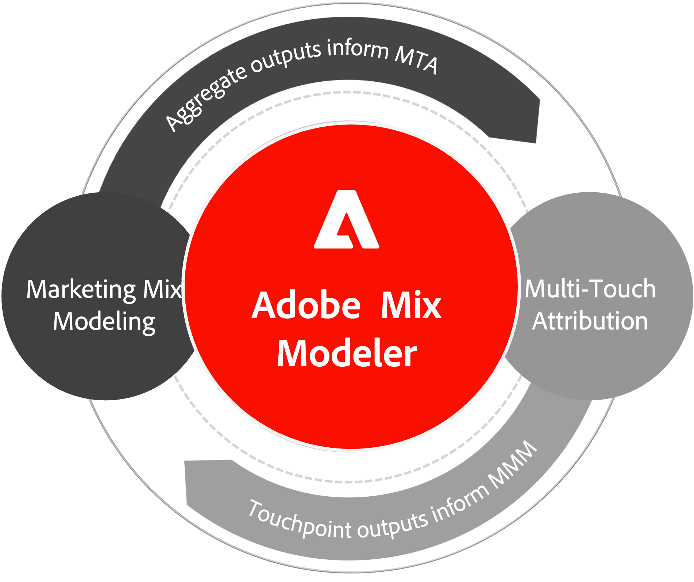

# Overzicht van Mix Modeler

Bekijk deze video voor een snel overzicht van de mogelijkheden van de Mix Modeler.

>[!VIDEO](https://video.tv.adobe.com/v/3424872/?learn=on)

Met Mix Modeler, aangedreven door Adobe Sensei, kunnen marketers campagnes meten en de planning op alle kanalen holistisch optimaliseren: betaald, verdiend en bezeten. De uniforme methodologie van de Commissie neemt stapsgewijs maatregelen op zowel het niveau van de marketingpunten als het niveau van de aggregaten, en zorgt tegelijkertijd voor volledig consistente resultaten.

Mix Modeler biedt het incrementele effect van alle marketingactiviteiten op zakelijke en campagneresultaten via een holistische (end-to-end) meettoepassing voor digitale en offline marketing.

Mix Modeler biedt de volgende soorten geoptimaliseerde en activeerbare inzichten op strategisch en tactisch niveau, zodat u beter kunt begrijpen:

* marketinguitgaven en de daaruit voortvloeiende prestaties langs verschillende kanalen, en
* aanbevolen investeringsniveaus om toekomstige bedrijfsdoelstellingen te verwezenlijken.

Voor deze functionaliteit combineert Mix Modeler:

* bottom-up (event-level) gegevens en top-down (aggregeniveau) gegevens;
* externe marktfactoren en interne factoren, en
* voorspellende en overdrachtsmethoden voor machinetolken.

Het bidirectionele overdrachtleren van AI/ML verenigt marketing mixmodellering (MMM) en multi-touch attributie (MTA) resultaten om verenigbare resultaten over meting en planning in een koekjeswereld te verzekeren.

{width="500" align="center"}

## Mogelijkheden

Mix Modeler biedt de volgende mogelijkheden:

| Capaciteit | Beschrijving |
|---|---|
| **Mate van incrementele prestaties** | Begrijp het stijgende ROI en effect van marketing over bedrijfsdoelstellingen of tactische campagnedoelstellingen. |
| **Resultaten in MMM en MTA verenigen** | Betere beslissingen nemen door de eenmaking van MMM- en MTA-modellen via transferleerprocessen. |
| **Begroting optimaal toewijzen** | Optimale begrotingstoewijzing vaststellen op basis van marketinguitgaven en impact op doelen. |
| **Begrotingsscenario&#39;s maken en vergelijken** | Ontwikkel veelvoudige begrotingsplannen en vergelijk hun effect om optimale besluiten voor uw zaken te nemen. |

{style="table-layout:auto"}
