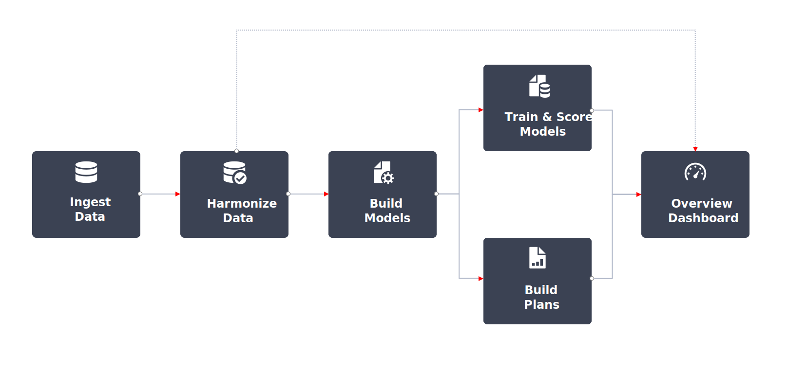

# Workflow voor Mixxen Modeler

Een typisch werkschema in Mix Modeler kijkt als:

|  | Activiteit | Beschrijving |
|---|---|---|
| {width="100"} | [**Samenvattingsgegevens**](../ingest-data/overview.md) | Gegevens over gebeurtenissen uit Adobe Experience Platform (bijvoorbeeld Adobe Analytics, Web SDK, andere bronnen), samengevoegde gegevens uit marketingkanalen (bijvoorbeeld tv, tuinen, e-mail, eigendom en beheerde activiteiten) en gegevens over externe factoren van klanten (bijvoorbeeld prijswijzigingen in abonnementsdiensten). |
| {width="100"} | [**Gegevens harmoniseren**](../harmonize-data/overview.md) | Vorm toewijzingsregels en de regels van de conflictoplossing om de diverse marketing datasets te verenigen nodig om campagneprestaties in Mix Modeler te meten en te plannen. |
| {width="100"} | [**Modellen configureren**](../models/create.md) | Vorm modelinstanties met marketing touchpoints (bijvoorbeeld kanalen) en omzettingsdefinities. |
| {width="100"} | [**Train- en scoremodellen**](../models/overview.md) | Samengevoegde scores en scores op gebeurtenisniveau maken met behulp van training en scoring in computers. |
| {width="100"} | [**Abonnementen maken**](../plans/overview.md) | Bepaal de beste toewijzing van marketingfondsen om een bedrijfsdoelstelling te bereiken aan de hand van de resultaten van de modellen van de Mix Modeler. |
| {width="100"} | [**Overzichtdashboard**](../dashboard/overview.md) | Bekijk de geharmoniseerde gegevens, modellen en plannen met behulp van verschillende configureerbare widgets. |

{style="table-layout:auto"}

