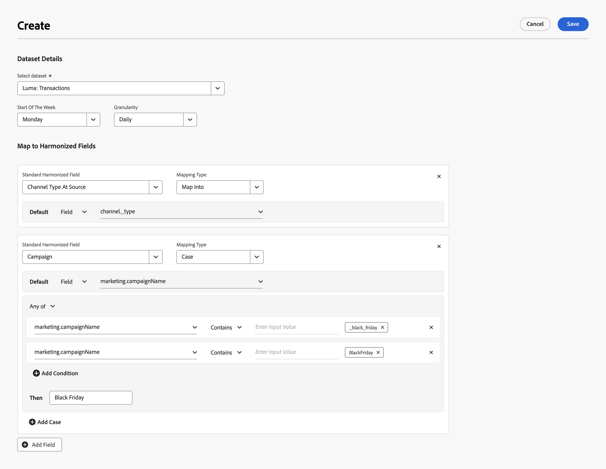

# Gegevensregels

De gegevenssetregels helpen u bij het in kaart brengen van uw geharmoniseerde gebieden met gebieden van de gegevens u in Mix Modeler hebt opgenomen.

* Voor geaggregeerde gegevens die u in Adobe Experience Platform hebt ingevoerd, wijst u een of meer van de beschikbare gegevenssetvelden toe aan de juiste geharmoniseerde velden.
* Voor gebeurtenisgegevens kunt u een of meer geharmoniseerde velden afzonderlijk toewijzen aan velden uit de gegevensset, rechtstreeks of met behulp van voorwaarden.

## Gegevenssetregels en toewijzingen beheren

Om een lijst van de beschikbare datasetafbeeldingen, in de interface van de Mix Modeler te zien:

1. Selecteren  **[!UICONTROL Harmonized data]** van de linkerspoorstaaf.

1. Selecteren **[!UICONTROL Dataset rules]** in de bovenste balk. U ziet een lijst van de datasetafbeeldingen.

De lijstkolommen specificeren details over de datasetafbeeldingen:

| Kolomnaam | Details |
| ---------------------- | ----------|
| Gegevensset | De naam van de gegevensset. |
| Bron | De bron van de dataset, die Adobe Analytics, de Gebeurtenissen van de Ervaring, Samenvatting (bijeengevoegde), of de Gebeurtenissen van de Ervaring van de Consumenten kan zijn. |
| Schema | Het schema waaraan de dataset voldoet. U kunt de schemanaam snel selecteren om het schema in een nieuw lusje in de schemaredacteur in Mix Modeler te openen - Schema&#39;s. |
| Korreligheid | De granulariteit van gegevens in de dataset. Mogelijke waarden zijn Dagelijks, Wekelijks, Maandelijks of Jaarlijks. |
| Begin van de week | Geeft aan welke dag van de week wordt beschouwd als het begin van een nieuwe week voor de specifieke gegevensset. |
| Laatst gewijzigd | Gegevens en tijdstip van de laatste wijziging van de gegevenssettoewijzing. |

{style="table-layout:auto"}

### Een gegevenssettoewijzing maken

Om een datasetafbeelding tot stand te brengen, in  **[!UICONTROL Harmonized data]** > **[!UICONTROL Dataset rules]** interface in Mix Modeler, selecteert u **[!UICONTROL Create Dataset Mapping]**.

In de **[!UICONTROL Create]** scherm,

1. In **[!UICONTROL Dataset Details]** selecteert u een gegevensset uit **[!UICONTROL Select dataset]** om met configuratie te beginnen.

1. Selecteer een dag voor de **[!UICONTROL Start of the week]**.

1. Selecteren **[!UICONTROL Daily]**, **[!UICONTROL Weekly]**, **[!UICONTROL Monthly]** of **[!UICONTROL Yearly]** for **[!UICONTROL Granularity]**.

1. Wanneer u een **[!UICONTROL Summary]** type gegevensset:

   1. Wijs elk van de **[!UICONTROL Available dataset fields]** voor **[!UICONTROL Standard harmonized fields]**. Als u een gegevenssetveld niet wilt toewijzen aan een geharmoniseerd veld, selecteert u expliciet **[!UICONTROL -- None --]**.

   1. Als u een nieuw geharmoniseerd veld nodig hebt dat niet beschikbaar is in de lijst, selecteert u **[!UICONTROL Create New]** een nieuw geharmoniseerd veld tot stand te brengen. U ziet het dialoogvenster zoals beschreven in [Een nieuw geharmoniseerd veld toevoegen](fields.md#add-a-harmonized-field) om snel een nieuw geharmoniseerd veld toe te voegen.

   1. Wanneer de toewijzing voor alle velden is voltooid, selecteert u **[!UICONTROL Save]**. Selecteren **[!UICONTROL Cancel]** om de toewijzing te annuleren.

      

1. Wanneer u een gebeurtenistype van dataset (**[!UICONTROL Experience Events]**, **[!UICONTROL Adobe Analytics]**, **[!UICONTROL Consumer Experience Events]**), in het gearceerde vak eronder **[!UICONTROL Map to harmonized fields]**:

   1. Een geharmoniseerd veld selecteren vanuit **[!UICONTROL Standard harmonized field]**.

   1. Wanneer het geselecteerde geharmoniseerde veld metrisch is:

      1. Selecteren **[!UICONTROL Count]** of **[!UICONTROL Sum]** van **[!UICONTROL Mapping type]**.

      1. Selecteer een **[!UICONTROL *Veld voor AEP-gegevensset *]**dat u het geharmoniseerde veld standaard wilt koppelen.

   1. Wanneer het geselecteerde veld van het type afmeting is:

      1. Selecteren **[!UICONTROL Map Into]** of **[!UICONTROL Case]** van **[!UICONTROL Mapping type]**.

      1. Wanneer u **[!UICONTROL Map Into]**, selecteert u **[!UICONTROL Field]** en **[!UICONTROL *Veld voor AEP-gegevensset *]**of **[!UICONTROL Value]**en een standaardwaarde om het geharmoniseerde veld standaard toe te wijzen aan het gegevenssetveld of de ingevoerde waarde.

      1. Wanneer u **[!UICONTROL Case]**, selecteert u **[!UICONTROL Field]** en **[!UICONTROL *Veld voor AEP-gegevensset *]**of **[!UICONTROL Value]**en een standaardwaarde om het geharmoniseerde veld standaard toe te wijzen aan het gegevenssetveld of de ingevoerde waarde.

         1. Bovendien definieert u een of meer gevallen, die bestaan uit een of meer voorwaarden om expliciet waarden in te stellen. Elke voorwaarde kan controleren op een specifieke **[!UICONTROL *Veld voor AEP-gegevensset *]**of **[!UICONTROL Exists]**of **[!UICONTROL Not Exists]**of **[!UICONTROL Contains]**,**[!UICONTROL Not Contains]**,**[!UICONTROL Equals]**,**[!UICONTROL Not Equals]**,**[!UICONTROL Starts With]**, of **[!UICONTROL Ends With]**een waarde ingevoerd om**[!UICONTROL * Voer de invoerwaarde in *]**.

         1. Selecteer  **[!UICONTROL Add case]** selecteert u  **[!UICONTROL Add condition]**.

         1. Als u een hoofdletter of voorwaarde wilt verwijderen, selecteert u  in de bijbehorende container.

         1. Om te selecteren of om het even welke of alle voorwaarden voor een geval zouden moeten van toepassing zijn, selecteer **[!UICONTROL Any of]** of **[!UICONTROL All of]**.

         1. Voer de waarde in op **[!UICONTROL Then]**.

      Het onderstaande voorbeeld

      * gebruikt een **[!UICONTROL Map Into]** **[!UICONTROL Mapping type]** om de **[!UICONTROL Channel Type At Source]** het geharmoniseerde gebied **[!UICONTROL channel_type]** veld van de **[!DNL Luma Transactions]** dataset.

      * gebruikt een **[!UICONTROL Case]** **[!UICONTROL Mapping]** tekst moet toewijzen aan de waarde van de optie **[!UICONTROL marketing.campaignName]** in het veld **[!DNL Luma Transactions]** gegevensset aan de **[!UICONTROL Campaign]** geharmoniseerd veld. Het geharmoniseerde veld Campagne is ingesteld op:

         * `Black Friday` wanneer de **[!UICONTROL marketing.campaignName]** is `_black_friday` of `BlackFriday`.
         * op de waarde van de **[!UICONTROL marketing.campaignName]** in alle andere gevallen.

        

1. Selecteren  **[!UICONTROL Add field]** om extra velden te definiëren.

Selecteer **[!UICONTROL Save]** om de toewijzing op te slaan, of selecteer **[!UICONTROL Cancel]** om de toewijzing te annuleren.

### Een gegevenssettoewijzing bewerken

Om een datasetafbeelding uit te geven, in  **[!UICONTROL Harmonized data]** > **[!UICONTROL Dataset rules]** interface in Mix Modeler:

1. Selecteren  in de **[!UICONTROL Dataset]** kolom voor de datasetafbeelding die u wilt uitgeven.
1. Selecteer in het contextmenu de optie  **[!UICONTROL Edit]** om te beginnen met het bewerken van de gegevenssettoewijzing. Zie [Een gegevenssettoewijzing maken](#create-a-dataset-mapping) voor meer informatie .

### Een gegevenssettoewijzing verwijderen

Om een datasetafbeelding te schrappen, in  **[!UICONTROL Harmonized data]** > **[!UICONTROL Dataset rules]** interface in Mix Modeler:

1. Selecteren  in de **[!UICONTROL Dataset]** kolom voor de datasetafbeelding die u wilt schrappen.
1. Selecteer in het contextmenu de optie  **[!UICONTROL Delete]** om de datasetafbeelding te schrappen.

## Gegevens synchroniseren

Om gegevens tussen uw geharmoniseerde gegevens en samenvatting en/of gebeurtenisdatasets, na alle logica in uw datasetregels te synchroniseren:

1. Selecteren **[!UICONTROL Sync data]**.

1. Van de **[!UICONTROL Sync data for dataset rules]** dialoogvenster selecteert u een van de **[!UICONTROL Refresh harmonized data for summary datasets]**, **[!UICONTROL Refresh harmonized data for event datasets]**, of **[!UICONTROL Refresh harmonized data for both summary + event datasets]**.

1. Selecteren **[!UICONTROL Sync]** om de synchronisatie te starten op basis van de gedefinieerde gegevenssetregels tussen geharmoniseerde gegevens en gegevens in gegevensreeksen. Selecteer **[!UICONTROL Cancel]**.

   
