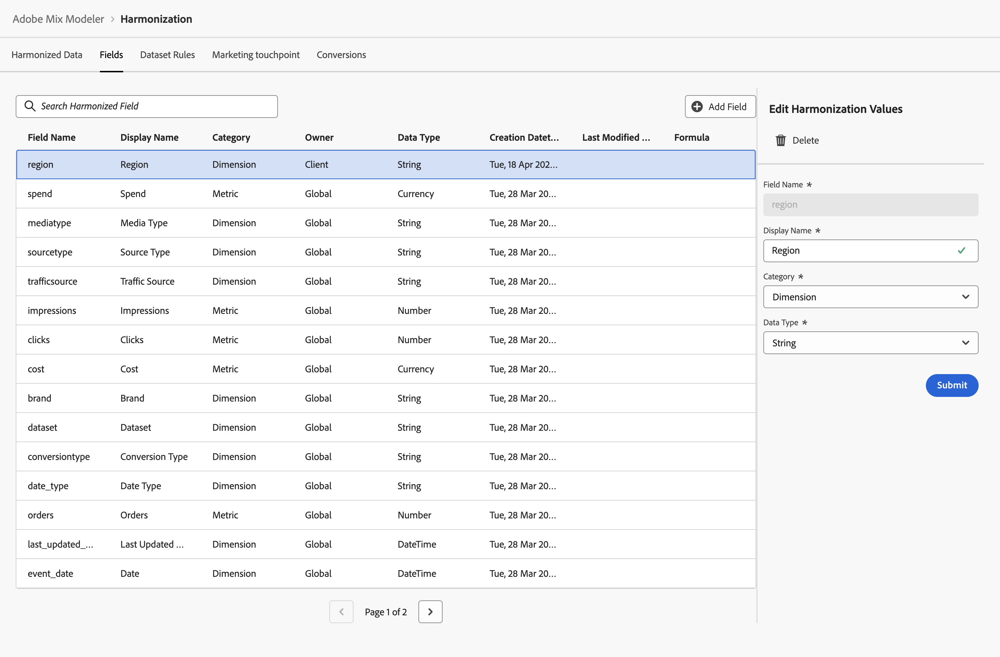

# Geharmoniseerde velden

Met geharmoniseerde velden kunt u velden definiëren voor conceptueel dezelfde gegevens, die afkomstig zijn van verschillende bronnen, elk met een eigen definitie van die gegevens. Een klikmeting kan bijvoorbeeld anders worden gedefinieerd en benoemd, afhankelijk van de gegevensbron. Als u op een geharmoniseerd veld klikt, kunt u een algemene nomenclatuur definiëren voor klikmetrische gegevens op basis van deze verschillende bronnen van klikgegevens.

Met geharmoniseerde velden kunt u de velden definiëren die u wilt gebruiken als onderdeel van de workflow voor het harmoniseren van gegevens. De gebieden u bepaalt kunnen in het bepalen van datasetregels, marketing worden gebruikt aanraakpunten en omzetting.

## Globale harmonisatievelden

De standaard beschikbare globale harmonisatievelden in de Modelleur van de Mengeling van de Adobe zijn:

| Veldnaam | Weergavenaam | Categorie | Gegevenstype | Opmerking |
| ---------------------- | ---------------------- | --------- | --------- | --------- |
| merk | Merk | Dimension | String |           |
| campagne | Campaign | Dimension | String |           |
| kanaal | Kanaal | Dimension | String |           |
| channel_id | Kanaal-id | Dimension | String |           |
| channel_type_at_source | Kanaaltype bij bron | Dimension | String |           |
| kanaal | Kanaal | Dimension | String |           |
| klikken | Klikken | Metrisch | Getal |           |
| conversietype | Conversietype | Dimension | String |           |
| kosten | Kosten | Metrisch | Valuta |           |
| gegevensset | Gegevensset | Dimension | String |           |
| date_type | Datumtype | Dimension | String | dag, week |
| e-mail | Verzonden e-mails | Metrisch | Getal |           |
| event_date | Datum | Dimension | DateTime |           |
| bruto_demand | Bruto-vraag | Metrisch | Valuta |           |
| indrukken | Impessies | Metrisch | Getal |           |
| last_updated_date | Laatst bijgewerkt op | Dimension | DateTime |           |
| koppelbezoeken | Bezoekingen koppelen | Metrisch | Getal |           |
| mediatype | Mediatype | Dimension | String |           |
| net_sales | Nettoverkoop | Metrisch | Valuta |           |
| orders | Orders | Metrisch | Getal |           |
| sourceType | Brontype | Dimension | String |           |
| besteden | Draaien | Metrisch | Valuta |           |
| verkeersbron | verkeersbron | Dimension | String |           |

{style="table-layout:auto"}

U kunt uw eigen geharmoniseerde velden toevoegen, bewerken of verwijderen boven op deze geharmoniseerde velden.

## Geharmoniseerde velden beheren

Om een lijst van de beschikbare geharmoniseerde gebieden te zien, in de interface van de Modelleur van de Adobe:

1. Selecteren  **[!UICONTROL Harmonized data]** van de linkerspoorstaaf.

1. Selecteren **[!UICONTROL Fields]** in de bovenste balk. U ziet een tabel met de geharmoniseerde velden.

   De tabelkolommen geven details over de geharmoniseerde velden

   | Kolomnaam | Details |
   | ---------------------- | ----------|
   | Veldnaam | De naam van het geharmoniseerde veld. |
   | Weergavenaam | De weergavenaam van het geharmoniseerde veld. Deze vertoningsnaam wordt gebruikt wanneer het bepalen van datasetregels, marketing touchpoint, en omzettingsdefinities. |
   | Categorie | Hiermee wordt opgegeven of een geharmoniseerd gegevensveld een [!UICONTROL Dimension], [!UICONTROL Metric] of [!UICONTROL Derived]. Een afgeleide categorie is een geharmoniseerd veld met behulp van een op cijfers gebaseerde definitie van formule. |
   | Eigenaar | Geeft aan of een geharmoniseerd veld een standaardveld is ([!UICONTROL Global]), of wordt door u gedefinieerd ([!UICONTROL Client]). |
   | Gegevenstype | Hiermee wordt het gegevenstype ([!UICONTROL Number], [!UICONTROL String], [!UICONTROL Currency], [!UICONTROL DateTime]). |
   | Aanmaakdatum | Datum en tijdstip waarop het geharmoniseerde veld wordt gecreëerd. |
   | Laatst gewijzigd datetime | Gegevens en tijdstip van de laatste wijziging van het geharmoniseerde veld. |
   | Formule | Geeft de formule aan voor een geharmoniseerd veld op basis van een afgeleide categorie. |

   {style="table-layout:auto"}

1. Om naar een specifiek geharmoniseerd gebied te zoeken, gebruik  **[!UICONTROL *Geharmoniseerd veld zoeken *]**.

### Een geharmoniseerd veld toevoegen

Om een geharmoniseerd veld toe te voegen,  **[!UICONTROL Harmonized data]** > **[!UICONTROL Fields]** interface in de Modelleur van de Mengeling van de Adobe:

1. Selecteren Veld toevoegen.

1. In de **[!UICONTROL Create]** dialoogvenster:

   1. Voer een **[!UICONTROL Field name]** bijvoorbeeld `region`.
   1. Voer een **[!UICONTROL Display name]** bijvoorbeeld `Region`.
   1. Selecteer een **[!UICONTROL Category]**: **[!UICONTROL Dimension]**, **[!UICONTROL Metric]** of **[!UICONTROL Derived]**.

      Wanneer u **[!UICONTROL Derived]** een **[!UICONTROL Formula]**. Om een geldige rekenkundige uitdrukking te bouwen, combineer één of meerdere metriek van **[!UICONTROL Insert Metric]** met een of meer operatoren **[!UICONTROL + - * / ( )]** . Bijvoorbeeld: `[orders]/[impressions]`

   1. Selecteer een **[!UICONTROL Data type]**.

      - **[!UICONTROL String]** of **[!UICONTROL DateTime]**, als de geselecteerde categorie Dimension is.
      - **[!UICONTROL Number]** of **[!UICONTROL Currency]** als de geselecteerde categorie Metrisch of Afgeleid is.

   1. Selecteren **[!UICONTROL Submit]** het geharmoniseerde veld toe te voegen. Selecteren **[!UICONTROL Close]** het dialoogvenster sluiten zonder het geharmoniseerde veld toe te voegen.

      

### Een geharmoniseerd veld bewerken

U kunt alleen geharmoniseerde velden bewerken die u eerder hebt gemaakt. U kunt een geharmoniseerd veld niet bewerken.

Als u een geharmoniseerd veld wilt bewerken, gaat u naar  **[!UICONTROL Harmonized data]** > **[!UICONTROL Fields]** interface in de Modelleur van de Mengeling van de Adobe:

1. Selecteer het geharmoniseerde veld dat u wilt bewerken. Bijvoorbeeld, **[!UICONTROL Region]**.

1. In de **[!UICONTROL Edit harmonization values]** deelvenster, waarden wijzigen voor **[!UICONTROL Display name]**, **[!UICONTROL Category]**, en **[!UICONTROL Data type]**.

1. Selecteren **[!UICONTROL Submit]** de wijzigingen op het geharmoniseerde veld toe te passen.

   

### Een geharmoniseerd veld verwijderen

U kunt alleen geharmoniseerde velden verwijderen die u eerder hebt gemaakt. U kunt een geharmoniseerd veld niet verwijderen.

Als u een geharmoniseerd veld wilt verwijderen, gaat u naar  **[!UICONTROL Harmonized data]** > **[!UICONTROL Fields]** interface in de Modelleur van de Mengeling van de Adobe:

1. Selecteer bijvoorbeeld het geharmoniseerde veld dat u wilt verwijderen **[!UICONTROL Region]**.

1. Selecteren  **[!UICONTROL Delete]** van de **[!UICONTROL Edit harmonization values]** linkerdeelvenster.

