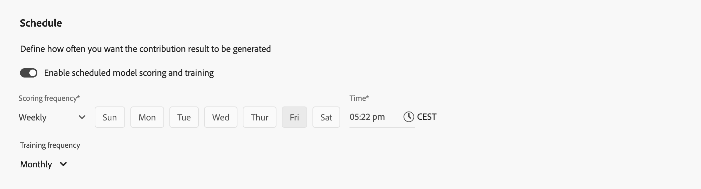

# Modellen maken

Om uw douaneAI-aangedreven modellen te bouwen, verstrekt de interface een stap-voor-stap geleide modelconfiguratiestroom.

In de  **[!UICONTROL Models]** in Mix Modeler, uitgezochte **[!UICONTROL Open model canvas]**.

## Instellen

U definieert naam en beschrijving in de stap **[!UICONTROL Setup]** :

1. Voer uw model in **[!UICONTROL Name]**, bijvoorbeeld `Demo model` . Voer een **[!UICONTROL Description]** in, bijvoorbeeld `Demo model to explore AI featues of Mix Modeler` .

   

1. Selecteer **[!UICONTROL Next]** om door te gaan naar de volgende stap. Selecteer **[!UICONTROL Cancel]** om de modelconfiguratie te annuleren.

## Configureren

U configureert uw model in de stap **[!UICONTROL Configure]** . De configuratie omvat de definitie van omzettingsdoelstellingen, marketing aanraakpunten, de in aanmerking komende gegevensbevolking, externe en interne factoren, en meer.

1. In de sectie **[!UICONTROL Conversion goal]** :

   

   1. Selecteer een conversie in het vervolgkeuzemenu **[!UICONTROL Conversion]** . De beschikbare omzettingen zijn de omzetting die u als deel van [&#x200B; Conversies &#x200B;](../harmonize-data/conversions.md) in [!UICONTROL Harmonized datasets] bepaalde. Bijvoorbeeld **[!UICONTROL Online Conversion]** .

   1. U kunt  selecteren **[!UICONTROL Create a conversion]** om een omzetting van binnen de modelconfiguratie direct tot stand te brengen.

1. In de **[!UICONTROL Marketing touchpoints]** sectie, kunt u één of meerdere marketing aanraakpunten selecteren, die aan de marketing aanraakpunten beantwoorden u als deel van [&#x200B; de Aanbiedingspunten van de Marketing &#x200B;](../harmonize-data/marketing-touchpoints.md) in [!UICONTROL Harmonized datasets] bepaalde.

   

   1. Selecteer een of meer marketingaanraakpunten in het vervolgkeuzemenu **[!UICONTROL Touchpoint include]** .

      * U kunt  om een touchpoint te verwijderen.
      * Met **[!UICONTROL Clear all]** kunt u alle aanraakpunten verwijderen.

   1. U kunt  selecteren **[!UICONTROL Create a touchpoint]** om een marketing contactpunt van binnen de modelconfiguratie direct tot stand te brengen.

   >[!NOTE]
   >
   >U kunt het model niet instellen met aanraakpunten die overlappende gegevens bevatten en er moet ten minste één aanraakpunt met doorgave zijn.

1. Standaard wordt een score gegenereerd voor alle gegevens in de geharmoniseerde weergave. Als u alleen een subset van de populatie wilt scoren, definieert u een of meer filters met behulp van containers in de sectie **[!UICONTROL Eligible data population]** .

   

   * Definieer voor elke container een of meer gebeurtenissen.

      1. Voor elke gebeurtenis:

         1. Selecteer metrisch of afmeting van **[!UICONTROL _Uitgezochte geharmoniseerd gebied_]**.

         1. Selecteer de juiste operator: **[!UICONTROL equals]**, **[!UICONTROL not equals]**, **[!UICONTROL less than]**, **[!UICONTROL greater than]**, **[!UICONTROL starts with]**, **[!UICONTROL doesn't start with]**, **[!UICONTROL ends with]**, **[!UICONTROL doesn't end with]**, **[!UICONTROL contains]**, **[!UICONTROL doesn't contain]**, **[!UICONTROL is in]** of **[!UICONTROL is not in]** .

         1. Ga of selecteer een waarde bij **[!UICONTROL _binnen of selecteer waarde_]**.

      1. Om een extra gebeurtenis in de container toe te voegen, voegt de uitgezochte  toe **[!UICONTROL Add event]**.

      1. Om een gebeurtenis uit de container te verwijderen, uitgezochte .

      1. Selecteer **[!UICONTROL Any of]** of **[!UICONTROL All of]** als u wilt filteren met alle of een van de meerdere gebeurtenissen die in de container zijn gedefinieerd. Het label verandert dienovereenkomstig van **[!UICONTROL Include ... Or ...]** in **[!UICONTROL Include ... And ...]** .

   * Om een in aanmerking komende container van de gegevenspopulatie toe te voegen, voegt de uitgezochte  toe **[!UICONTROL Add eligible population]**.

   * Om een in aanmerking komende container van de gegevenspopulatie, binnen de container te verwijderen, selecteer , en selecteer **[!UICONTROL Remove marketing touchpoint]** van het contextmenu.

   * Selecteer **en** en **of** tussen containers om complexere definities voor uw in aanmerking komende gegevenspopulatie te bouwen.

1. Als u gegevenssets met externe factoren wilt toevoegen aan uw model, gebruikt u een of meer containers in de sectie **[!UICONTROL External factors dataset]** . Een voorbeeld van externe factoren zijn S&amp;P-indexen.

   

   * Voor elke container:

      1. Voer een **[!UICONTROL External factor name]** in, bijvoorbeeld `External Factors` .

      1. Selecteer een gegevensset in het vervolgkeuzemenu **[!UICONTROL Dataset]** . U kunt  selecteren om datasets te beheren. Zie [&#x200B; Datasets &#x200B;](../ingest-data/datasets.md) voor meer informatie.

      1. Selecteer een optie in het vervolgkeuzemenu **[!UICONTROL Impact on conversion]** : **[!UICONTROL Auto select]** , **[!UICONTROL Positive]** of **[!UICONTROL Negative]** . De standaardoptie is **[!UICONTROL Auto select]** , waarmee het model de impact kan bepalen. U kunt de standaardinstelling overschrijven.

   * Om een extra externe container van de factordataset toe te voegen, voegt de uitgezochte  toe **[!UICONTROL Add external factor]**.

   * Om een externe container van de factordataset te verwijderen, selecteer .

1. Als u gegevenssets met interne factoren wilt toevoegen aan uw model, gebruikt u een of meer containers in de sectie **[!UICONTROL Internal factors dataset]** . Een voorbeeld van interne factoren zijn marketinggegevens via e-mail.

   

   * Voor elke container:

      1. Voer een **[!UICONTROL Internal factor name]** in, bijvoorbeeld `Email Marketing Data` .

      1. Selecteer een dataset van **[!UICONTROL _Selecteer een dataset_]**. U kunt  selecteren om datasets te beheren. Zie [&#x200B; Datasets &#x200B;](../ingest-data/datasets.md) voor meer informatie.

      1. Selecteer een optie in het vervolgkeuzemenu **[!UICONTROL Impact on conversion]** : **[!UICONTROL Auto select]** , **[!UICONTROL Positive]** of **[!UICONTROL Negative]** .

   * Om een extra interne container van de factordataset toe te voegen, voegt de uitgezochte  **[!UICONTROL Add internal factor]** toe.

   * Om een interne container van de factordataset te verwijderen, selecteer .

1. Voer een waarde in tussen `1` en `52` in **[!UICONTROL Give contribution credit to touchpoints occurring within]** ... **[!UICONTROL weeks prior to the conversion]** om het terugzoekvenster voor het model te definiëren.

1. Selecteer **[!UICONTROL Next]** om door te gaan naar de volgende stap. Als er meer configuratie nodig is, wordt met een rode omtrek en tekst uitgelegd welke aanvullende configuratie vereist is.   Uitgezocht **[!UICONTROL Back]** om naar de vorige stap terug te gaan.   Uitgezocht **[!UICONTROL Cancel]** om de modelconfiguratie te annuleren.

## Geavanceerd

U kunt geavanceerde instellingen opgeven in de stap **[!UICONTROL Advanced]** . In deze stap kunt u uw model inschakelen voor multitouch-kenmerk (MTA).

1. In de sectie **[!UICONTROL Spend share]** :

   * Activeer **[!UICONTROL Allow spend share]** als u historische investeringsverhoudingen voor marketing wilt gebruiken om het model op de hoogte te brengen wanneer er weinig marketinggegevens beschikbaar zijn. Deze instelling wordt aanbevolen, vooral in de volgende scenario&#39;s:
      * Een kanaal heeft niet genoeg observaties (bijvoorbeeld lage bestedingsfrequentie, indrukken of klikken).
      * U modelleert de pieken, maar regelmatig, en potentieel hoge bestedende media (zoals TV voor sommige merken), waar de gegevens kunnen gering zijn.

     >[!NOTE]
     >
     >Voor eenmalige investeringen (bijvoorbeeld een Super Bowl-advertentie) is het wellicht beter om die gegevens als factor in te voeren in plaats van te vertrouwen op het aandeel in de uitgaven.
     >

1. In de sectie **[!UICONTROL MTA enabled]** :

   * Activeer **[!UICONTROL MTA enabled]** als u MTA-functies voor het model wilt inschakelen. Als u MTA hebt ingeschakeld, zijn de multi-touchkenmerkinzichten beschikbaar nadat u uw model hebt getraind en gescoord. Zie het [&#x200B; lusje van de Attributie &#x200B;](insights.md#attribution) in [&#x200B; Modelinzichten &#x200B;](insights.md).

1. In de sectie **[!UICONTROL Prior knowledge]** :

   

   1. Selecteer de **[!UICONTROL Rule type]** , die standaard is **[!UICONTROL Absolute values]** .

   1. Geef met de kolom **[!UICONTROL Contribution proportion]** bijdragepercentages op voor elk van de kanalen die onder **[!UICONTROL Name]** worden vermeld.

   1. Indien van toepassing, kunt u voor elk kanaal een **[!UICONTROL Level of confidence]** percentage toevoegen.

   1. Gebruik indien nodig **[!UICONTROL Clear all]** om alle invoerwaarden voor de kolommen **[!UICONTROL Contribution proportion]** en **[!UICONTROL Level of confidence]** te wissen.

## Schema

U kunt training en scording voor uw model plannen in de stap **[!UICONTROL Schedule]** .

1. In de sectie **[!UICONTROL Schedule]** kunt u modeltraining en -scoring plannen.

   

   Aan geplande modelscore en opleiding:

   1. Schakel **[!UICONTROL Enable scheduled model scoring and training]** in.
   1. Selecteer een **[!UICONTROL Scoring frequency]** :

      * **[!UICONTROL Daily]**: Ga een geldige tijd (bijvoorbeeld `05:22 pm`) in of gebruik .
      * **[!UICONTROL Weekly]**: Selecteer een dag van de week en ga een geldige tijd (bijvoorbeeld `05:22 pm`) in of gebruik .
      * **[!UICONTROL Monthly]**: Selecteer een dag van de maand van de Looppas op elk dropdown menu en ga een geldige tijd (bijvoorbeeld `05:22 pm`) in of gebruik .

   1. Selecteer een **[!UICONTROL Training frequency]** in de vervolgkeuzelijst: **[!UICONTROL Monthly]** , **[!UICONTROL Quarterly]** , **[!UICONTROL Yearly]** of **[!UICONTROL None]** .

1. Selecteer in de sectie **[!UICONTROL Define training window]** tussen:

   

   * **[!UICONTROL Have Mix Modeler select a helpful training window]** en

   * **[!UICONTROL Manually input a training window]**. Wanneer deze optie is geselecteerd, definieert u het aantal jaren in **[!UICONTROL Include events the following years prior to a conversion]** .

1. Selecteer **[!UICONTROL Finish]** om de modelconfiguratie te voltooien.

   * Selecteer **[!UICONTROL Ok]** in het dialoogvenster **[!UICONTROL Create instance?]** om de eerste reeks training en scoring direct te starten. Uw model is vermeld met status  **[!UICONTROL Awaiting training]**.

     Selecteer **[!UICONTROL Cancel]** om te annuleren.

   * Als er meer configuratie nodig is, wordt met een rode omtrek en tekst uitgelegd welke aanvullende configuratie vereist is.

   Selecteer **[!UICONTROL Back]** om terug te gaan naar de vorige stap.

   Selecteer **[!UICONTROL Cancel]** om de modelconfiguratie te annuleren.
