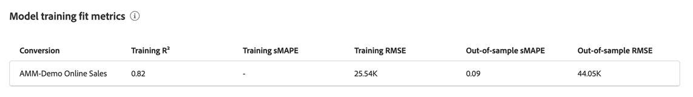

# Modelinzichten

Elke visualisatie in modelinzichten wordt ontworpen om u te helpen:

* De impact van de marketingactiviteiten van uw organisatie visualiseren en kwantificeren.
* Identificeer welke kanalen hoog presteren.
* Bepaal welke kanalen eventueel moeten worden geoptimaliseerd.

Deze inzichten helpen u dan om middelprioriteiten en toewijzing te steunen.

Om modelinzichten, in de  **[!UICONTROL Models]** interface in Mix Modeler te bekijken:

1. Selecteer in de tabel **[!UICONTROL Models]** de naam van een model met de waarde **[!UICONTROL Last run status]** of ● . **[!UICONTROL Success]**.

1. Selecteer **[!UICONTROL Model Insights]** in het contextmenu.

De volgende tabbladen zijn beschikbaar:

* [Modelinzichten](#model-insights)
* [&#x200B; Factoren &#x200B;](#factors-beta) [!BADGE &#x200B; bèta &#x200B;]
* [&#x200B; Attributie &#x200B;](#attribution) (slechts voor MTA toegelaten modellen)
* [&#x200B; Diagnose &#x200B;](#diagnostics)
* [&#x200B; Historisch overzicht &#x200B;](#historical-overview).

U kunt de datumperiode wijzigen waarop de visualisaties op elk tabblad zijn gebaseerd. Ga een datumperiode in of selecteer  om een datumperiode te selecteren.

## Modelverloop

{{release-limited-testing-section}}

Als het model zakt, wordt er een dialoogvenster **[!UICONTROL Model drift detected]** weergegeven met opties die later of direct aan [**[!UICONTROL Retrain]**](overview.md#retrain) het model moeten worden herinnerd. Als u **[!UICONTROL Remind me later]** selecteert, wordt u herinnerd de volgende dag of bij volgende login.

## [!UICONTROL Model insights]

Het modellusje van Inzichten toont visualisaties voor [&#x200B; Bijdrage door datum en basismedia &#x200B;](#contribution-by-date-and-base-media), [&#x200B; Bijdrage door kanaal &#x200B;](#contribution-by-channel), [&#x200B; de prestatiessamenvatting van de Marketing &#x200B;](#marketing-performance-summary), en [&#x200B; Marginale reactiecurven &#x200B;](#marginal-response-curves). Het lusje verstrekt ook a [&#x200B; de onderbreking van het aanraakpunt &#x200B;](#touchppint-breakdown) lijst.

* U kunt de muis boven afzonderlijke diagramelementen in elke visualisatie houden om een popover met meer details weer te geven.

* Om een Csv- dossier te downloaden dat de gegevens voor visualisatie bevat, uitgezochte .

* Om de volledige gegevens van modelinzichten in Microsoft® Excel formaat te downloaden, selecteer  **[!UICONTROL Download data]**.

### Bijdrage op datum en basismedia.

Deze gestapelde grafiekvisualisatie wordt als volgt geordend:

* De basis wordt onderaan weergegeven.
* Kanalen die niet worden uitgegeven, worden in het midden weergegeven.
* De steunkleurkanalen worden bovenaan weergegeven.

Deze visualisatie vertegenwoordigt het bijdragepercentage dat wordt bereikt door basis, door uitgavenkanalen en door niet-bestede kanalen over een datumbereik. Deze visualisatie is handig om incrementele beelden te laten zien. De basis vertegenwoordigt wat zonder enige marketing überhaupt zou zijn gebeurd, en de niet-bestede kanalen plus uitgavenkanalen (bovenop de basis) attribuut aan uw marketing effect. Kortom, niet-bestede plus-uitgaven staan gelijk aan de incrementele impact van uw marketingactiviteiten en de visualisatie zorgt ervoor dat insight de waarde die marketing genereert, kan waarmaken.

### Bijdrage per kanaal

Een donutvisualisatie die laat zien dat de bijdrage via verschillende kanalen wordt verdeeld. Deze visualisatie toont incrementele kwesties door de lens van top drie uitvoerend kanalen (exclusief basis en *Alle andere* categorieën). De visualisatie helpt bij het ondersteunen van prioriteiten en begrotingstoewijzing.

### Overzicht van de marketingprestaties.

Een horizontale visualisatie van de staafgrafiek die de prestaties van ROI of CPA door elk van de kanalen toont. Deze visualisatie benadrukt het ROI/CPA van uw marketing investeringen. De kanalen worden gerangschikt in dalende orde die op ROI/CPA wordt gebaseerd. De visualisatie helpt om te identificeren welke kanalen het meest effectief zijn en die optimalisering zouden kunnen vereisen.

### Marginale responscurven.

Het lijndiagram visualiseert en vergelijkt de marginale opbrengsten die door de investering in uw marketing kanalen worden geproduceerd.  En identificeert het break-even punt waar uw stijgende terugkeer minder dan uw stijgende uitgave is. Hierdoor helpt deze visualisatie u te begrijpen wanneer uw marketinginvestering minder effect begint te sorteren.

De curve, het break-even punt en de bijbehorende waarden worden berekend op basis van het geselecteerde gegevensbereik en het kanaal dat u hebt geselecteerd.

Het kanaal wijzigen:

* Selecteer een kanaal in het vervolgkeuzemenu **[!UICONTROL Channel]** om de visualisatie voor een specifiek kanaal bij te werken.

### Uitsplitsing naar aanraakpunt

De lijst van de touchpoint onderbreking toont wekelijkse touchpoint onderverdelingen voor alle of geselecteerde kanalen, op een wekelijkse basis, tonend zeer belangrijke metriek verbonden aan elk. De tabel maakt een eenvoudige vergelijking, identificatie van trends en het bijhouden van prestaties mogelijk op een korter kanaalniveau. Deze lijst vult uitdrukkelijk de [&#x200B; Bijdrage door datum en basismedia &#x200B;](#contribution-by-date-and-base-media) visualisatie en de [&#x200B; Bijdrage door kanaal &#x200B;](#contribution-by-channel) visualisatie aan.

De volgende kolommen zijn beschikbaar:

| Kolom | Beschrijving |
|---|---|
| **[!UICONTROL Date range]** | De week waarin verslag moet worden uitgebracht. |
| **[!UICONTROL Touchpoint]** | Het specifieke aanraakpuntkanaal. |
| **[!UICONTROL ROI]** | Het percentage van (**[!UICONTROL Revenue]** - **[!UICONTROL Spend]**) / **[!UICONTROL Spend]**. |
| **[!UICONTROL Revenue]** | De inkomsten voor de datumreeks. |
| **[!UICONTROL CPA]** | **[!UICONTROL Spend]** / **[!UICONTROL Conversions]** . |
| **[!UICONTROL Conversions]** | De conversies voor het datumbereik. |
| **[!UICONTROL Spend]** | De uitgaven voor het gegevensbereik. |

Als u een specifiek kanaal of alle kanalen wilt selecteren, selecteert u een kanaal in het vervolgkeuzemenu **[!UICONTROL View]** .

Om de inhoud van de lijst van de de onderbreking van het Aanraakpunt te downloaden, selecteer  **[!UICONTROL Download CSV]**.

## **[!UICONTROL Factors]** [!BADGE &#x200B; bèta &#x200B;]

Het lusje van de Factoren [!BADGE &#x200B; bèta &#x200B;] toont externe factor verwante inzichten.

Deze visualisatie helpt u om het stijgende effect te begrijpen dat diverse interne en externe factoren op de basislijn van omzettingen hebben. Bijvoorbeeld economische voorwaarden of promotieactiviteiten.

Selecteer in het vervolgkeuzemenu **[!UICONTROL Factors]** welke factoren u wilt weergeven.

<!-- need to update the image when we do have a proper example -->

Om een Csv- dossier te downloaden dat de gegevens voor de lijst bevat, uitgezochte .

Als geen gegevens beschikbaar zijn ziet u een bericht  **[!UICONTROL No data is available, you may need to retrain your model, or change the date range to view insights]**.

## [!UICONTROL Attribution]

>[!NOTE]
>
>Het tabblad Attributie is alleen beschikbaar voor MTA-modellen.

Met het tabblad [!UICONTROL Attribution] kunt u de effectiviteit begrijpen van aanraakpunten en marketingcampagnes die gegevens op gebeurtenisniveau bevatten.  Zie [&#x200B; model &#x200B;](build.md) bouwen.

De volgende attribuutmodellen worden ondersteund:

* Gebaseerd op het geselecteerde model in Mix Modeler:
   * Algorithmic - Invloed
   * Algorithmic - Incrementeel
* Gebaseerde regel:
   * Vervaleenheden
   * Eerste aanraking
   * Laatste aanraking
   * Lineair
   * Ushape

Zie [&#x200B; Multi-aanraking attributie &#x200B;](../get-started/about.md#multi-touch-attribution) voor een inleiding op het multi-aanraak attributievermogen in Mix Modeler.

Selecteer een of meer toewijzingsmodellen in het vervolgkeuzemenu **[!UICONTROL Attribution Model]** . De geselecteerde attributiemodellen zijn van toepassing op alle visualisaties op het tabblad Kenmerken.

De granulaire gebeurtenisscores voor Mix Modeler-multitouch-kenmerk worden uitgelijnd op de algemene Mix Modeler-scores en -rendement. Deze scores worden ook beschikbaar gesteld als datasets in Experience Platform.

Het tabblad Kenmerken bestaat uit de volgende visualisaties:

### [!UICONTROL Overview]

De [!UICONTROL Overview] visualisatie toont, voor de geselecteerde attributiemodellen, de omzettingstotalen en de percentages. Als u meer modellen selecteert, worden extra cirkels aan de visualisatie toegevoegd, elk met een eigen kleur die overeenkomt met de legenda.

Als u een pop-up met details voor een attributiemodel wilt zien, houdt u de muisaanwijzer boven een van de cirkels in de visualisatie.

### [!UICONTROL Trends]

De visualisatie [!UICONTROL Daily trends] , [!UICONTROL Weekly trends] of [!UICONTROL Monthly trends] geeft voor de geselecteerde attributiemodellen de dagelijkse, wekelijkse of maandelijkse conversietrends weer.

Om de periode te kiezen, selecteer **[!UICONTROL Daily trends]**, **[!UICONTROL Weekly trends]** of **[!UICONTROL Monthly trends]** van .

Als u details wilt zien, houdt u de muisaanwijzer boven de gegevensregel van een specifiek toewijzingsmodel om een pop-up weer te geven met het totale aantal conversies voor die gegevens.

### [!UICONTROL Breakdown]

De [!UICONTROL Breakdown] visualisatie is een uitsplitsing per kanaal of aanraakpunt van de conversies voor elk van de geselecteerde attributiemodellen. Deze visualisatie kan nuttig zijn om besluiten over de doeltreffendheid van elk kanaal of touchpoint te nemen.

Om het verdelingstype te kiezen, selecteer **[!UICONTROL Breakdown by channel]** of **[!UICONTROL Breakdown by touchpoint]** van .

Houd de muisaanwijzer boven de diagramelementen om de details weer te geven.

### [!UICONTROL Top campaigns]

In de visualisatie van de bovenste campagnes wordt een tabel met de bovenste campagnes weergegeven met kolommen voor Campagnenaam, Kanaal, Mediatype en Incrementele conversies. Deze visualisatie kan uw team helpen de doeltreffendheid van een specifieke campagne voor een bepaald kanaal te informeren en inzichten te verstrekken in welke campagnes u verder in zou moeten investeren.

Als u de tabel in oplopende ↑ of aflopende volgorde ↓ wilt sorteren voor Kanaal, Mediatype of Incrementele conversies, selecteert u de kolomkop en schakelt u de sortering in of uit.

Om de lijst in een afzonderlijke dialoog uit te breiden, selecteer **[!UICONTROL Expand]** van .

Het uitgevouwen dialoogvenster Boven bevat dezelfde tabel met optelde kolommen voor

* Incrementele omzettingen
* Influente omzettingen
* Eerste aanraakconversies
* Laatste aanraakconversies

  U kunt elk van de extra kolomkoppen selecteren om de tabel in oplopende of aflopende volgorde te sorteren.

Selecteer **[!UICONTROL Close]** om het uitgevouwen dialoogvenster Bovenste campagnes te sluiten.

### [!UICONTROL Breakdown by touchpoint position]

De visualisatie van [!UICONTROL Breakdown by touchpoint position] is een uitsplitsing van toegewezen omzettingen naar positie van het aanraakpunt en aanraakpunt over alle conversiepaden. Met dit diagram kunt u vergelijken of een aanraakpunt op een positie beter bijdraagt dan de resterende positie en andere aanraakpunten op een willekeurige positie.

>[!NOTE]
>
>De som van de procentuele bijdrage voor een toewijzingsmodel voor alle aanraakpunten en posities moet gelijk zijn aan 100.

De posities [!UICONTROL Starter], [!UICONTROL Player] en [!UICONTROL Closer] worden als volgt gedefinieerd:

| Positie | Beschrijving |
|---|---|
| [!UICONTROL Starter] | Deze positie geeft aan of het aanraakpunt de eerste aanraking in een conversiepad is. |
| [!UICONTROL Player] | Deze positie geeft aan of het aanraakpunt niet het eerste of laatste aanraakpunt is dat wordt omgezet. |
| [!UICONTROL Closer] | Deze positie geeft aan of het aanraakpunt het laatste aanraakpunt is vóór de conversie. |

### [!UICONTROL Top conversion paths]

De [!UICONTROL Top conversion paths] visualisatie toont de bovenste 5 omzettingspaden op basis van de geselecteerde attributiemodellen.

Voor elk conversiepad ziet u:

* het aantal kanalen dat wel van invloed is;
* het totaal van de toegewezen paden;
* het percentage toegewezen paden voor dit conversiepad versus het totale toegewezen pad;
* voor elk kanaal, het bijdragepercentage van het toewijzingsmodel, en
* de som van deze bijdragepercentages van het kanaaltoewijzingsmodel.

## [!UICONTROL Diagnostics] {#diagnostics}

>[!CONTEXTUALHELP]
>id="models_diagnostics_modelassessment"
>title="Modelbeoordelingsgrafieken"
>abstract="Modelbeoordelingsvisualisaties worden afgebroken op feitelijke versus voorspelde of residuele omzettingen."
>additional-url="https://experienceleague.adobe.com/nl/docs/mix-modeler/using/overview" text="Mix Modeler-overzicht"
>additional-url="https://video.tv.adobe.com/v/3440794/?learn=on&enablevpops" text="Mix Modeler demo"

>[!CONTEXTUALHELP]
>id="models_diagnostics_pathstouched"
>title="Paden aangeraakt"
>abstract="Paden die worden aangeraakt, zijn het percentage paden dat wordt omgezet en het percentage paden dat niet voor elk aanraakpunt wordt omgezet."

>[!CONTEXTUALHELP]
>id="models_diagnostics_modeldateinfo"
>title="Modeldatum vanaf"
>abstract="De gegevens voor deze tabel worden alleen voor specifieke tijdsperioden gegenereerd.  De **[!UICONTROL As of]** -datum geeft aan wanneer de gegevens zijn gegenereerd en is gebaseerd op gegevens van startDate tot endDate."

Op het tabblad **[!UICONTROL Diagnostics]** worden visualisaties weergegeven voor:

* **[!UICONTROL Model Assessment]** visualisaties, die bestaan uit:

  

   * Een grafiek die u kunt afsplitsen op werkelijke versus voorspelde of restomzettingen.
Als u de visualisatie wilt onderbreken, selecteert u een van de volgende opties in de lijst **[!UICONTROL Breakdown]** .

      * **[!UICONTROL Actual vs Predicted]**: met deze optie worden echte waarden vergeleken met modelvoorspellingen. In het ideale geval zouden de voorspelde waarden strak moeten worden uitgelijnd met de werkelijke waarden, hoewel enige afwijking wordt verwacht. Grote of systematische afwijkingen of patronen kunnen wijzen op ontbrekende relaties en gegevens of potentiële vooroordelen.

      * **[!UICONTROL Residuals]**: met deze optie wordt het verschil getoond tussen werkelijke en voorspelde waarden. Een goed presterend model heeft residuen die willekeurig worden verdeeld, zonder duidelijke patronen of stijgende spreiding. Gestructureerde trends of het verbreden van residuen kunnen wijzen op ontbrekende relaties en gegevens of variantiekwesties.

   * Een tabel met de volgende kolommen voor elke metrische omzetting:

      * **[!UICONTROL Actual Conversion]**
      * **[!UICONTROL Predicted Conversion]**
      * **[!UICONTROL Residual Conversion]**
      * **[!UICONTROL R2]**, een score die vertelt hoe goed de gegevens het regressiemodel (de goodness van passen) passen.
      * **[!UICONTROL MAPE]** (Gemiddelde Absolute Percentagefout), een van de meest gebruikte PKI&#39;s om de nauwkeurigheid van de voorspelling te meten en geeft de voorspelde fout weer als een percentage van de werkelijke waarde.
      * **[!UICONTROL RMSE]** (Basisgemiddelde vierkante fout): hiermee wordt de gemiddelde fout weergegeven, gewogen op basis van het vierkant van de fout.

  Om een Csv- dossier te downloaden dat de gegevens voor de lijst bevat, uitgezochte .

* **[!UICONTROL Model training fit metrics]** die voor elke metrische conversie wordt weergegeven:

  

   * **[!UICONTROL Training R2]**: Wijst op het aandeel van variatie in de daadwerkelijke waarden die door de voorspellingen van het model worden verklaard, die zich van 0 tot 1 uitstrekken.
   * **[!UICONTROL Training sMAPE]** (symmetrisch gemiddelde absolute percentagefout): hiermee wordt het gemiddelde percentage van de fout in de trainingsgegevens gemeten. Lagere waarden geven een betere nauwkeurigheid aan.
   * **[!UICONTROL Training RMSE]** (basisgemiddelde kwadraatfout): hiermee wordt het gemiddelde percentage van de fout in de trainingsgegevens gemeten. Past grotere fouten meer dan MAPE. Lagere RMSE suggereert betere voorspellende nauwkeurigheid maar is gevoelig voor uitschieters.
   * **[!UICONTROL Out-of-sample sMAPE]**: evalueert percentagefout op onzichtbare gegevens, in evenwicht brengend over en ondervoorspelt. Helpt de generalisatie te beoordelen. Momenteel evalueert Mix Modeler het percentage van de fout met behulp van het laatste kwartaal van de trainingsgegevens als een holdout-set.
   * **[!UICONTROL Out-of-sample RMSE]**: evalueert percentagefout op onzichtbare gegevens, in evenwicht brengend over en ondervoorspelt. Helpt de generalisatie te beoordelen. Momenteel evalueert Mix Modeler het percentage van de fout met behulp van het laatste kwartaal van de trainingsgegevens als een holdout-set. RMSE penalizes grotere fouten meer dan MAPE.

* **[!UICONTROL Touchpoint effectiveness]** , die het resultaat van het algoritmische model van Attribution AI vertegenwoordigt.

  

  De gegevens voor deze tabel worden alleen voor specifieke tijdsperioden gegenereerd. Selecteer **[!UICONTROL As of *xx/xx/xx, xx :xx TZ *]** voor meer details.

  De visualisatie toont, in dalende orde van [!UICONTROL Efficiency measure] , voor elk touchpoint:

   * **[!UICONTROL Paths touched]**: visualiseert het percentage paden dat omgezet en het percentage paden dat geen omzetting bereikt. Voor een aanraakpunt ziet u meer toegeschreven omzettingen wanneer de hoogte van de conversieverhouding van de eigenschap is. Deze verhouding vergelijkt het percentage wegen die tot omzetting tegenover het percentage wegen leiden die *niet* tot omzetting leiden.
   * **[!UICONTROL Efficiency measure]**: wordt gegenereerd door het algoritmische toewijzingsmodel. De efficiëntiemaatstaf geeft het relatieve belang aan van een aanraakpunt voor conversie, onafhankelijk van het aanraakpuntvolume. De efficiëntie wordt gemeten op een schaal van 1 tot 5. Het hogere aanraakpuntvolume garandeert geen hogere efficiëntiemaatstaf.
   * **[!UICONTROL Total volume]**: Het totale aantal keren dat een gebruiker een aanraakpunt aanraakt. Het aantal is inclusief van aanraakpunten die op een weg verschijnen die omzetting evenals wegen *bereiken niet* resulterend in omzetting.

### Modeldriftdetectie

>[!AVAILABILITY]
>
>De in deze sectie beschreven functionaliteit bevindt zich in de beperkte testfase van de release en is mogelijk nog niet beschikbaar in uw omgeving. Deze notitie wordt verwijderd wanneer de functionaliteit algemeen beschikbaar is. Voor informatie over het de versieproces van Mix Modeler, zie [&#x200B; de eigenschapversies van Mix Modeler &#x200B;](/help/releases/latest.md).
>

Als het model zakt, ziet u bovenaan een **[!UICONTROL Model drift detected]** -melding.

Selecteer **[!UICONTROL Hide]** om de melding te verbergen. Het bericht wordt de volgende dag of bij de volgende aanmelding opnieuw weergegeven.

## [!UICONTROL Historical overview]

Op het tabblad Historisch overzicht ziet u visualisaties voor:

### Omzetting en besteding per fiscaal kwartaal en per product

Deze visualisatie vertegenwoordigt de conversie en bestede distributie over verschillende kwartalen binnen het gegeven datumbereik. De visualisatie helpt hoogpresterende kwarten te identificeren waar het uitgeven omzettingen drijft.

### Per kanaal

Deze visualisatie vertegenwoordigt de uitgavendistributie over diverse kanalen binnen de bepaalde datumwaaier. De visualisatie ondersteunt een snelle identificatie van de kanalen die het meest worden uitgegeven.

### Aanraakpuntdoorsnede

Deze visualisatie vertegenwoordigt de uitgavendistributie over betaalde aanraakpunten voor elk kwartaal binnen de bepaalde datumwaaier. De visualisatie maakt het mogelijk te begrijpen welke aanraakpunten binnen specifieke kanalen en kwarten prioriteit hebben. De visualisatie helpt kanaalbestedingspatronen en trends te identificeren, met name kanalen met lage en weinig uitgaven in de loop van de tijd.

Om een alternatief op uitgaven-gebaseerd kanaal te selecteren om voor deze visualisatie te tonen:

* Selecteer een kanaal in **[!UICONTROL Channels]** .

### Volume aanraakpunt

Deze visualisatie vertegenwoordigt de volumeverdeling over alle aanraakpunten voor elk kwartaal binnen het gegeven datumbereik.

U kunt als volgt een alternatief op volume gebaseerd kanaal selecteren dat voor deze visualisatie moet worden weergegeven:

* Selecteer een kanaal in **[!UICONTROL Channels]** .

## **[!UICONTROL Edit]**

U kunt de naam, beschrijving en het plannen van opleiding en het noteren van het model uitgeven.

1. Selecteer  uitgeven

1. In het dialoogvenster **[!UICONTROL Edit model]** :

   * Voer een nieuwe **[!UICONTROL Name]** en **[!UICONTROL Description]** in.

   * Schakel **[!UICONTROL Status]** in om planning in te schakelen. U kunt het plannen voor modellen slechts toelaten die worden opgeleid en worden gescoord.

      1. Selecteer een **[!UICONTROL Scoring frequency]** :

         * **[!UICONTROL Daily]**: Ga een geldige tijd (bijvoorbeeld `05:22 pm`) in of gebruik .
         * **[!UICONTROL Weekly]**: Selecteer een dag van de week en ga een geldige tijd (bijvoorbeeld `05:22 pm`) in of gebruik .
         * **[!UICONTROL Monthly]**: Selecteer een dag van de maand van de Looppas op elk dropdown menu en ga een geldige tijd (bijvoorbeeld `05:22 pm`) in of gebruik .

      1. Selecteer een **[!UICONTROL Training frequency]** in de vervolgkeuzelijst: **[!UICONTROL Monthly]** , **[!UICONTROL Quarterly]** , **[!UICONTROL Yearly]** of **[!UICONTROL None]** .

      uit

1. Selecteer **[!UICONTROL Save]**.
