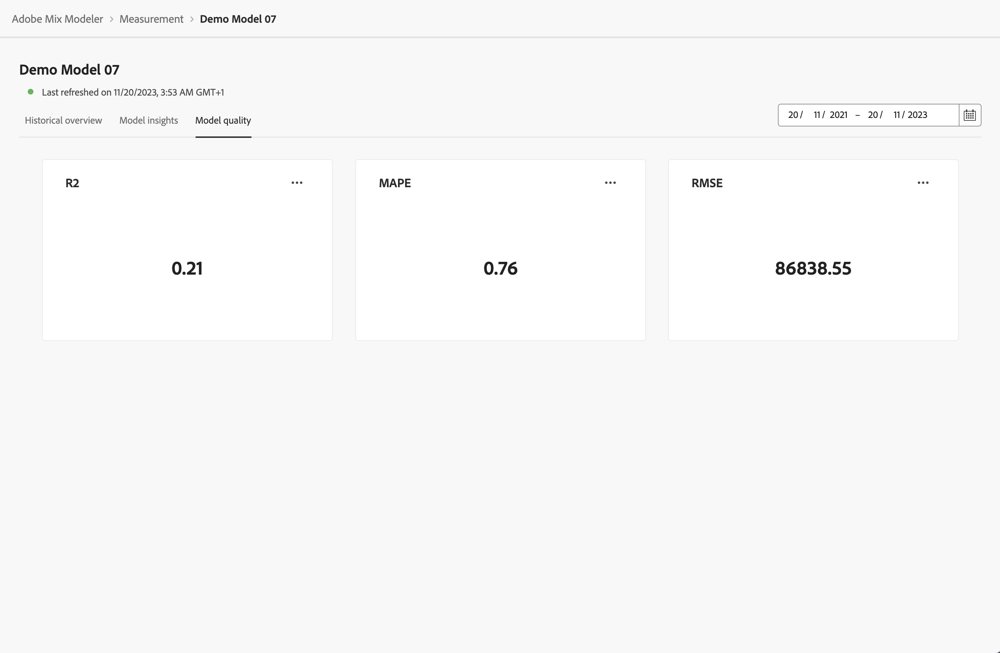

# Modelinzichten

Om modelinzichten te bekijken, in  **[!UICONTROL Models]** interface in Mix Modeler:

1. Selecteer de naam van een model met een **[!UICONTROL Last run status]** van ● **[!UICONTROL Success]** van de **[!UICONTROL Models]** tabel.

1. Selecteer in het contextmenu de optie **[!UICONTROL Model Insights]**.

U ziet wanneer het opgegeven model voor het laatst is vernieuwd en de widgets worden weergegeven met drie tabbladen: Historisch overzicht, Modelinzichten en Modelkwaliteit.

U kunt de datumperiode wijzigen waarop de widgets op elk tabblad zijn gebaseerd. Voer een datumpunt in of selecteer  om een datumpunt te selecteren.

## Historisch overzicht

Het tabblad Historisch overzicht bevat widgets voor:

* Omzetting en besteding per fiscaal kwartaal en per product

* Per kanaal

* Aanraakpuntdoorsnede

  U kunt een alternatief op uitgaven gebaseerd kanaal selecteren om voor deze widget te tonen. Een kanaal selecteren vanuit **[!UICONTROL Channels]**.

* Volume aanraakpunt

  U kunt een alternatief op volume gebaseerd kanaal selecteren om voor deze widget weer te geven. Een kanaal selecteren vanuit **[!UICONTROL Channels]**.

## Modelinzichten

Het tabblad Modelinzichten bevat widgets voor:

* Bijdrage per datum en basismedia

* Bijdrage per kanaal

* Overzicht van marketingprestaties

U kunt de muisaanwijzer boven afzonderlijke diagramelementen in elke widget plaatsen om een pop-up met meer details weer te geven.

## Modelkwaliteit

Op het tabblad Modelkwaliteit worden widgets voor meten weergegeven:

* R2 (R-kwadraat), dat vertelt hoe goed de gegevens in het regressiemodel passen (de goedheid van fit).

* MAPE (gemiddelde absolute percentagefout), een van de meest gebruikte PKI&#39;s om de nauwkeurigheid van de voorspelling te meten en geeft de voorspelde fout weer als percentage van de werkelijke waarde.

* RMSE (Root Mean Square Error): geeft de gemiddelde &quot;error&quot; aan, gewogen volgens het vierkant van de fout.

