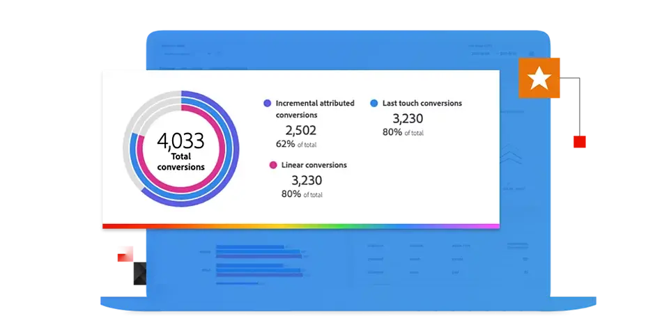

# Adobe Mix Modeler-gids

Deze technische documentatiegids verstrekt zelfhulp voor Adobe **Mix Modeler**. Mix Modeler is een Adobe Experience Cloud-toepassing die campagnes meet en de planning horizontaal optimaliseert op alle kanalen: betaald, verdiend en eigendom. Mix Modeler is gebouwd op Adobe Experience Platform en wordt aangedreven door Adobe Sensei.

## Beginnen met de basisbeginselen

<table style="table-layout:fixed">
  <tr style="border: 0;">
    <td>
    
    
<strong> Snel begin </strong>  krijgt een overzicht van en insight in het werkschema van Mix Modeler.

    </td>
    <td>
    
    
<strong> Samenvatting gegevens </strong>  leren hoe te om gebeurtenis en samengevoegde of samenvattingsgegevens in Mix Modeler in te voeren.

    </td>
    <td>
    
    
<strong> harmoniseer gegevens </strong>  leren hoe te om aggregaat en gebeurtenisgegevens in een verenigbare gegevensmening toe te passen. 
    

    </td>
    <td>
    
    
<strong> Model &amp; van het Plan </strong>  Lijn en score uw modellen en gebruik de inzichten voor uw marketing plannen.

    </td>
  </tr>
  <tr style="border: 0;">
    <td align="center"></td>
    <td align="center"></td>
    <td align="center"></td>
    <td align="center"></td>
    </tr>
</table>

## Documentatie verkennen

<table style="table-layout:fixed">
  <tr style="border: 0;">
    <td>
       
      <strong> Ingest gegevens </strong>  <a href="/help/ingest-data/overview.md"> Overzicht </a> - <a href="/help/ingest-data/schemas.md"> Schema's </a> - <a href="/help/ingest-data/datasets.md"> Datasets </a> 
    </td>
    <td>
       
      <strong> harmoniseer gegevens </strong>  <a href="/help/harmonize-data/overview.md"> Overzicht </a> - <a href="/help/harmonize-data/fields.md"> Gebieden </a> - <a href="/help/harmonize-data/dataset-rules.md"> de regels van de Dataset </a> - <a href="/help/harmonize-data/marketing-touchpoints.md"> Aanbiedingstouchpoints </a> - <a href="/help/harmonize-data/conversions.md"> Conversies </a> - <a href="/help/harmonize-data/usage-report.md"> het rapport van het Gebruik </a>  
    </td>
    <td>
       
      <strong> Modellen </strong>  <a href="/help/models/overview.md"> Overzicht </a> - <a href="/help/models/build.md"> bouwt modellen </a> - <a href="/help/models/insights.md"> Modelinzichten </a> - <a href="/help/models/scoring-data.md"> Gebruik het scoren gegevens </a>
    </td>
  </tr>
  <tr style="border: 0;">
    <td>
       
      <strong> Abonnementen </strong>  <a href="/help/plans/overview.md"> Abonnementen </a> - <a href="/help/plans/build.md"> bouwt plannen </a> - <a href="/help/plans/compare.md"> vergelijkt plannen </a> - <a href="/help/plans/build.md"> Inzichten van het Plan </a>
    </td>
    <td>
       
      <strong> Overzicht </strong>  <a href="/help/dashboard/overview.md"> Schema's </a> - <a href="/help/dashboard/harmonized-data.md"> Geharmoniseerde gegevens </a> - <a href="/help/dashboard/plans.md"> Plannen </a>
    </td>
        <td>
       
      <strong> Leerprogramma's </strong>  <a href="https://experienceleague.adobe.com/docs/mix-modeler-learn/tutorials/overview.html?lang=en"> Overzicht </a> - <a href="https://experienceleague.adobe.com/docs/mix-modeler-learn/tutorials/intro/use-cases.html?lang=en"> De gevallen van het Gebruik </a> - <a href="https://experienceleague.adobe.com/docs/mix-modeler-learn/tutorials/intro/user-workflow.html?lang=en"> het werkschema van de Gebruiker </a> - <a href="https://experienceleague.adobe.com/docs/mix-modeler-learn/tutorials/intro/user-interface-tour.html?lang=en"> Reis van het gebruikersinterface </a>
    </td>
  </tr>
</table>
