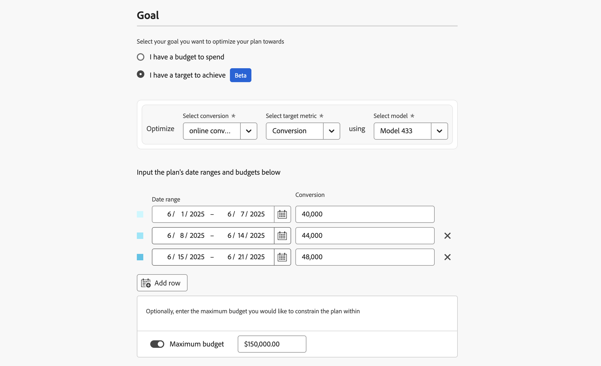
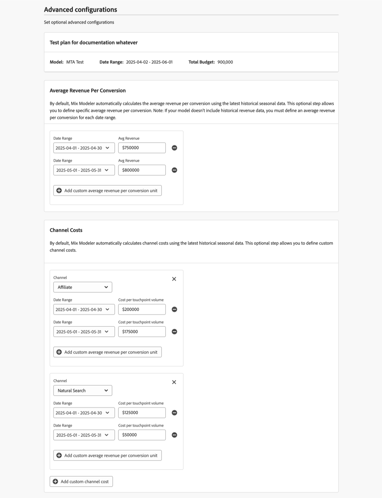

# Abonnementen maken

In Mix Modeler maakt u een abonnement met de wizard Abonnement. In de plantovenaar, kunt u opstelling de details en de begrotingen of doelmetriek van uw plan en het onderliggende model voor uw plan gebruiken. Nadat u details, budget, meetgegevens en model hebt opgegeven, kunt u doorgaan met een door AI aanbevolen plan of de uitgave via het kanaal bewerken. U hebt de optie om geavanceerde configuraties op gemiddelde opbrengst per omzetting en kanaalkosten te bepalen.

U moet het doel bepalen u uw plan tegen wilt maximaliseren. Dit doel kan een begroting zijn die u kunt uitgeven of een doel u wilt bereiken. Als het doel een doel is, moet u extra waarden voor te gebruiken doel metrisch specificeren: omzetting, opbrengst, CPA of ROI.

Om een plan, in de  **[!UICONTROL Plans]** interface in Mix Modeler tot stand te brengen, selecteer **[!UICONTROL Create plan]**.

1. In het **[!UICONTROL Plan creation]** -scherm:

   1. In de sectie **[!UICONTROL Setup]** :

      1. Voer een **[!UICONTROL Plan name]** in, bijvoorbeeld `Goal based plan` . Voer een **[!UICONTROL Description]** in, bijvoorbeeld `A goal based plan` .
      1. Selecteer a **[!UICONTROL Model]** van **[!UICONTROL _Uitgezocht een optie._.]**

         

   1. Selecteer in de sectie **[!UICONTROL Goal]** het doel waarnaar u uw abonnement wilt optimaliseren. U kunt kiezen tussen

      * **[!UICONTROL I have a budget to spend]**

        

        Met deze optie kunt u budgetten voor een of meer datumbereiken invoeren.

         1. In de container **[!UICONTROL Optimize]** :
            1. Selecteer een conversie in het vervolgkeuzemenu **[!UICONTROL Select conversion]** .
            1. Selecteer een model in het vervolgkeuzemenu **[!UICONTROL Select model]** .
         1. Specificeer a **[!UICONTROL Date range]**, of door data te typen of een datumwaaier te selecteren gebruikend .
         1. Voer een **[!UICONTROL Budget]** in.
Om extra datumwaaiers, elk met hun begroting toe te voegen, selecteer  **[!UICONTROL Add row]**.
Om een datumwaaier en een bijbehorend budget te schrappen, uitgezochte .
         1. Een optioneel maximumbudget definiëren dat u wilt beperken tot:
            1. Schakel **[!UICONTROL Maximize budget]** in.
            1. Geef het bedrag van de maximumbegroting op. Het bedrag moet gelijk zijn aan of hoger zijn dan het totale bedrag van de voor de datumbereiken gespecificeerde begrotingen.

      * **[!UICONTROL I have a target to achieve]** [!BADGE  Beta ]

        

         1. In de container **[!UICONTROL Optimize]**
            1. Selecteer een conversie in het vervolgkeuzemenu **[!UICONTROL Select conversion]** .
            1. Selecteer een doel-metrische waarde in het vervolgkeuzemenu **[!UICONTROL Select target metric]** . U kunt kiezen tussen **[!UICONTROL Conversion]** , **[!UICONTROL CPA]** , **[!UICONTROL Revenue]** of **[!UICONTROL ROI]** .
            1. Selecteer een model in het vervolgkeuzemenu **[!UICONTROL Select model]** .
         1. Specificeer een waaier van de Datum, of door data te typen of een datumwaaier te selecteren gebruikend .
         1. Voer een waarde in voor de geselecteerde doelmetrische waarde. Bijvoorbeeld een getal voor **[!UICONTROL Conversion]**, een percentage voor **[!UICONTROL ROI]** of valutawaarden voor **[!UICONTROL CPA]** en **[!UICONTROL Revenue]** .
Om extra datumwaaiers toe te voegen, elk met hun doel metrisch, uitgezochte  **[!UICONTROL Add row]**.
Om een datumwaaier en bijbehorende doel metrisch te schrappen, uitgezochte .
         1. Een optioneel maximumbudget definiëren dat u wilt beperken tot:
            1. Schakel **[!UICONTROL Maximize budget]** in.
            1. Geef het bedrag van de maximumbegroting op.

   1. Selecteer **[!UICONTROL Next]** .

1. In het dialoogvenster **[!UICONTROL Done with all required fields]** :

   

   * Selecteer  **[!UICONTROL Create plan now]** als u een AI geadviseerd plan met voorspelde ROI wilt produceren. Selecteer **[!UICONTROL OK]** . Uw abonnement is gemaakt.

   * Selecteer  **[!UICONTROL Edit channel budgets first]** als u kanaalbegroting wilt uitgeven en geavanceerde configuraties bepalen alvorens een plan met voorspelde ROI wordt gecreeerd.  Selecteer **[!UICONTROL OK]** , zodat u in de volgende stap het kanaal kunt definiëren dat u in **[!UICONTROL Spend selection]** uitgeeft.

     >[!IMPORTANT]
     >
     >De informatie hieronder is slechts relevant als u  **[!UICONTROL Edit channel budgets first]** hebt geselecteerd

1. In de **[!UICONTROL Spend selection]** sectie, voor elke waaier van de begrotingsdatum, gebruik  om de mening van de kanaaldistributie voor die gegevenswaaier te openen.

   U kunt historische referentiegegevens gebruiken als u gegevens en inzichten van marketinguitgaven wilt gebruiken. U kunt historische referentiegegevens gebruiken voor:

   * Verbeter de begrotingstoewijzing door de nadruk te leggen op goed presterende kanalen en slecht presterende kanalen.
   * Ondersteuning van trendanalyse.
   * Identificeer efficiënte strategieën en vermijd fouten terwijl het vormen van plannen.

   Als u een historische referentieperiode selecteert, kunt u zich richten aan vorige voorkeuren van het uitgavenpatroon en de planningsfunctionaliteit van Mix Modeler kan plannen produceren die binnen uw verwachtingen zijn. Deze plannen moeten uiteindelijk het vertrouwen van de belanghebbenden vergroten, ervoor zorgen dat marketingplannen strategisch en efficiënt zijn en dat deze plannen gebaseerd zijn op bewezen prestatiegegevens en bedrijfsbehoeften.

   

   1. Selecteer de **[!UICONTROL Spend pattern]** .

      * De standaardoptie is **[!UICONTROL Automatic]** .
      * Selecteer **[!UICONTROL Historical reference]** en voer een **[!UICONTROL Start date]** in om te verwijzen naar gegevens voor marketinguitgaven die al beschikbaar zijn voor Mix Modeler. **[!UICONTROL End date]** wordt automatisch bepaald gebaseerd op de datumwaaier waarvoor u het uitgavenpatroon bepaalt. De voorgestelde aanvangsdatum is de eerste beschikbare uitgavendatum in het verleden. Om erop te wijzen hebt u een niet bestaande of ongeldige historische verwijzingsperiode geselecteerd, ziet u a .

   1. Als u budgetten voor elk kanaal wilt definiëren, voert u een waarde in voor **[!UICONTROL Min]** en **[!UICONTROL Max]** of gebruikt u de schuifregelaars.

   1. Als u wilt schakelen tussen valuta- of percentageinvoer, selecteert u **[!UICONTROL $]** of **[!UICONTROL %]** for **[!UICONTROL View spend by]** . Deze schakeloptie is uitgeschakeld als u doelmeetgegevens hebt geselecteerd die niet op valuta zijn gebaseerd.

   1. Selecteer **[!UICONTROL Create]** als u klaar bent.
      

   1. Selecteer **[!UICONTROL Next]** .

1. In de sectie **[!UICONTROL Advanced configurations]** kunt u optionele geavanceerde configuraties invoeren.

   

   * De naam, het model, het datumbereik en het totale budget van uw abonnement worden samengevat.

   * Mix Modeler berekent standaard automatisch de gemiddelde omzet per conversie aan de hand van de meest recente seizoensgebonden gegevens. In **[!UICONTROL Average Revenue per conversion]** kunt u specifieke gemiddelde omzet per omzetting bepalen.

      1. Voor elk datumbereik in uw budget:

         1. Selecteer een datumbereik in het vervolgkeuzemenu **[!UICONTROL Date range]** .
         1. Voer een **[!UICONTROL Average revenue]** -waarde in.

      1. Selecteer  voeg douanegemiddelde opbrengst per omzettingseenheid toe om een datumwaaier toe te voegen.
      1. Selecteer  om een datumwaaier te verwijderen.

     >[!NOTE]
     >
     >Als uw model geen historische opbrengstgegevens omvat, moet u een gemiddelde opbrengst per omzetting voor elke datumwaaier bepalen u voor uw begroting specificeerde.
     >

   * Standaard berekent Mix Modeler automatisch kanaalkosten aan de hand van de meest recente seizoensgebonden gegevens. In **[!UICONTROL Channel costs]** kunt u aangepaste kanaalkosten definiëren.

      1. Voor elk kanaal in uw model, bepaal een kosten van het douanekanaal.

         1. Selecteer een kanaal in het vervolgkeuzemenu **[!UICONTROL Channel]** .
         1. Voor elk datumbereik in uw budget:
            1. Selecteer een datumbereik in het vervolgkeuzemenu **[!UICONTROL Date range]** .
            1. Voer een **[!UICONTROL Average revenue]** -waarde in.
         1. Selecteer  **[!UICONTROL Add custom average revenue per conversion unit]** om een datumwaaier toe te voegen.
         1. Selecteer  om een datumwaaier te verwijderen.

      1. Selecteer  **[!UICONTROL Add custom channel cost]** om een kanaal toe te voegen.
      1. Selecteer  om een douanekanaal te verwijderen.

1. Selecteer **[!UICONTROL Create]** als u klaar bent.

1. Selecteer **[!UICONTROL Create plan]** in het dialoogvenster **[!UICONTROL Create plan]** om uw abonnement te maken. Selecteer **[!UICONTROL Cancel]** om het maken van uw abonnement te annuleren. Er wordt een dialoogvenster **[!UICONTROL No work is saved]** weergegeven ter bevestiging.

