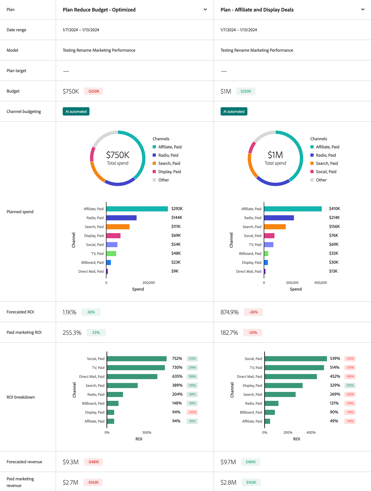

# Abonnementen vergelijken

Om plannen in de interface van de Abonnementen van de Modellen van de Adobe te vergelijken:

* Selecteren  **[!UICONTROL Compare Plans]**. Selecteer bij Vergelijkingsplannen een abonnement voor elke **[!UICONTROL _Abonnement selecteren_]**.

* U kunt ook twee plannen selecteren in de tabel Plannen en op de actiebalk selecteren  **[!UICONTROL Compare]**.

De Compare planinterface toont informatie en widgets op:

* Plan
* Datumbereik
* Model
* Begroting
* Het type Mix
* Uitsplitsing van uitgaven
* voorspelde ROI
* Uitsplitsing naar ROI
* Voorspelde terugkeer

U kunt de muisaanwijzer boven afzonderlijke diagramelementen in elke widget plaatsen om een pop-up met meer details weer te geven.

Selecteren **[!UICONTROL Close]** om terug te keren naar het overzicht van de plannen.
