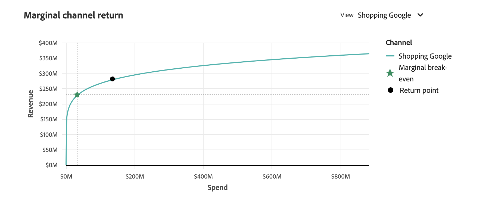
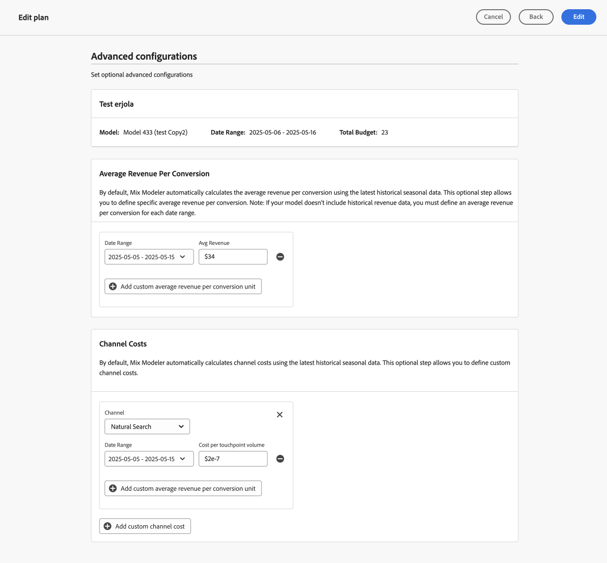

# Abonnementen

In [!UICONTROL Plan insights] worden uw overzichtsinzichten gemaakt en worden de [!UICONTROL Model] , de [!UICONTROL Data range] en [!UICONTROL Total budget] weergegeven waarop het abonnement is gebaseerd.

Wanneer het terugwinnen, ziet u een overzicht van uw plan, dat uit bestaat:

- [!UICONTROL Forecasted paid channel ROI] visualisatie
- [!UICONTROL Forecasted revenue] visualisatie
- [!UICONTROL Forecasted conversion] visualisatie
- [!UICONTROL Marginal channel return] visualisatie
- [!UICONTROL Data range breakdown] tabel van het plan, met kolommen voor

   - Kanaal
   - ROI
   - CPA
   - Ontvangsten
   - Conversiedoel
   - Draaien

Selecteer **[!UICONTROL Close]** om de interface te sluiten.

Als u wilt wijzigen hoe de ROI van uw abonnement wordt weergegeven, selecteert u **[!UICONTROL X]** of **[!UICONTROL &#x200B; %]** at **[!UICONTROL View ROI]** .

## Voorspelde betaalde kanaaluitgaven en ROI

Deze visualisatie toont een scatterplot voor de voorgeprogrammeerde uitgaven en het rendement van investeringen op uw betaalde kanalen, gebaseerd op het model, de datumwaaier en het budget.

## Geraamde ontvangsten

Deze visualisatie van het staafdiagram toont de voorspelde opbrengst voor uw kanalen die op het model, de datumwaaier en het budget wordt gebaseerd.

## Voorspelde omzettingen

Deze visualisatie van het staafdiagram toont de voorspelde omzettingen voor uw kanalen die op het model, de datumwaaier en het budget worden gebaseerd.

## Marginale kanaal return

Deze visualisatie van het lijndiagram toont een marginale terugkeerkromme voor het geselecteerde kanaal met indicatoren voor **[!UICONTROL Marginal break-even]** en **[!UICONTROL Return point]**. Deze visualisatie helpt u te begrijpen hoe het uitgeven voor een kanaal van het bereiken van een marginale break-even punt is en of u ruimte hebt om uitgaven in een kanaal te verhogen of minder aan een kanaal zou moeten uitgeven om het kanaal te verbeteren besteedt efficiency.

Als u een specifiek kanaal voor de visualisatie wilt selecteren, selecteert u een kanaal in het vervolgkeuzemenu **[!UICONTROL View]** .

## Uitsplitsing naar datumbereik

In de tabel [!UICONTROL Date range breakdown] worden gedetailleerde gegevens per kanaal weergegeven voor [!UICONTROL ROI] , [!UICONTROL Revenue] , [!UICONTROL CPA] , [!UICONTROL Conversions] en [!UICONTROL Spend] .

1. Om een Csv- dossier te downloaden dat de gegevens van de de waaierverdeling van de Datum bevat, uitgezochte  **[!UICONTROL Download CSV]**. Vanuit het contextmenu:

   - Selecteer  **[!UICONTROL Detailed CSV]** voor gedetailleerde gegevens in formaat CSV.
   - Selecteer  **[!UICONTROL Summary CSV]** voor summiere gegevens in formaat CSV.

   Gedetailleerde gegevens zijn korrelgegevens die per week worden vastgelegd. De summiere gegevens worden gehouden door de model-verstrekte datumwaaier.

1. Selecteer **[!UICONTROL All channels]**, **[!UICONTROL Paid channels]** of **[!UICONTROL Non-paid channels]** in de **[!UICONTROL View]** -selectie om de indeling van het datumbereik op categorie kanalen weer te geven.

## Plan bewerken

1. Om uw plan uit te geven, uitgezocht  **[!UICONTROL Edit plan]** uit:

   In de **[!UICONTROL Spend selection]** sectie, voor elke waaier van de begrotingsdatum, gebruik  om de mening van de kanaaldistributie voor die gegevenswaaier te openen.

   U kunt historische referentiegegevens gebruiken als u gegevens en inzichten van marketinguitgaven wilt gebruiken. U moet rekening houden met historische referentiegegevens voor:

   - Verbeter de begrotingstoewijzing door de nadruk te leggen op goed presterende kanalen en slecht presterende kanalen.
   - Ondersteuning van trendanalyse.
   - Identificeer efficiënte strategieën en vermijd fouten terwijl het vormen van plannen.

   Als u een historische referentieperiode selecteert, kunt u zich richten aan vorige voorkeuren van het uitgavenpatroon en de planningsfunctionaliteit van Mix Modeler kan plannen produceren die binnen uw verwachtingen zijn. Deze plannen moeten uiteindelijk het vertrouwen van de belanghebbenden vergroten, ervoor zorgen dat marketingplannen strategisch en efficiënt zijn en dat deze plannen gebaseerd zijn op bewezen prestatiegegevens en bedrijfsbehoeften.

   

   1. Selecteer de **[!UICONTROL Spend pattern]** .

      - Standaard is dit **[!UICONTROL Automatic]** .
      - Selecteer **[!UICONTROL Historical reference]** en voer een **[!UICONTROL Start date]** in om te verwijzen naar gegevens voor marketinguitgaven die al beschikbaar zijn voor Mix Modeler. De **[!UICONTROL End date]** wordt automatisch bepaald op basis van het geselecteerde gegevensbereik. De voorgestelde begindatum is de eerste beschikbare uitgavengegevens uit het verleden voor marketing. Om erop te wijzen hebt u een niet bestaande historische verwijzingsperiode geselecteerd, ziet u a .

   1. Als u de budgetten voor elk kanaal wilt wijzigen, wijzigt u de waarden voor **[!UICONTROL Min]** en **[!UICONTROL Max]** of gebruikt u de schuifregelaars.

   1. Als u wilt schakelen tussen valuta- of percentageinvoer, selecteert u **[!UICONTROL $]** of **[!UICONTROL %]** for **[!UICONTROL View spend by]** .

   1. Selecteer **[!UICONTROL Edit details]** als u de details van uw abonnement wilt bewerken:

      1. Wijzig in de sectie **[!UICONTROL Setup]** (indien van toepassing) de secties **[!UICONTROL Plan name]** en **[!UICONTROL Description]** .

      1. In de sectie **[!UICONTROL Budget]** :

         1. Wijzig **[!UICONTROL Date range]** voor één of meer van de de datumwaaiers van uw plan, of door data te typen of een datumwaaier te selecteren gebruikend .

         1. Wijzig **[!UICONTROL Budget]** voor één of meerdere van de de datumwaaiers van uw plan.

         Om extra datumwaaiers, elk met hun begroting toe te voegen, selecteer  **[!UICONTROL Add row]**.

         Om een datumwaaier en een bijbehorend budget te schrappen, uitgezochte .

         Een maximumbegroting vaststellen:

         1. Schakel **[!UICONTROL Maximize budget]** in.
         1. Geef het bedrag van de maximumbegroting op. Het bedrag moet gelijk zijn aan of hoger zijn dan het totale bedrag van de begrotingen die voor de datumbereiken zijn gespecificeerd.

      1. Selecteer **[!UICONTROL Next]** om terug te keren naar de sectie **[!UICONTROL Spend]** . Selecteer **[!UICONTROL Cancel]** om terug te keren naar het overzicht van uw plannen.

         

   1. Selecteer **[!UICONTROL Next]** als u geavanceerde configuraties voor uw abonnement hebt gedefinieerd.

      

      - De naam, het model, het datumbereik en het totale budget van uw abonnement worden samengevat.

      - Mix Modeler berekent standaard automatisch de gemiddelde omzet per conversie aan de hand van de meest recente seizoensgebonden gegevens. In **[!UICONTROL Average Revenue per conversion]** kunt u specifieke gemiddelde omzet per omzetting bepalen.

         1. Voor elk datumbereik in uw budget:
            1. Selecteer een datumbereik in het vervolgkeuzemenu **[!UICONTROL Date range]** .
            1. Voer een **[!UICONTROL Average revenue]** -waarde in.

         1. Selecteer  voeg douanegemiddelde opbrengst per omzettingseenheid toe om een datumwaaier toe te voegen.
         1. Selecteer  om een datumwaaier te verwijderen.

        >[!NOTE]
        >
        >Als uw model geen historische opbrengstgegevens omvat, moet u een gemiddelde opbrengst per omzetting voor elke datumwaaier bepalen u voor uw begroting specificeerde.
        >

      - Standaard berekent Mix Modeler automatisch kanaalkosten aan de hand van de meest recente seizoensgebonden gegevens. In **[!UICONTROL Channel costs]** kunt u aangepaste kanaalkosten definiëren.

         1. Voor elk kanaal in uw model, bepaal de kosten van het douanekanaal.
            1. Selecteer een kanaal in het vervolgkeuzemenu **[!UICONTROL Channel]** .
            1. Voor elk datumbereik in uw budget:
               1. Selecteer een datumbereik in het vervolgkeuzemenu **[!UICONTROL Date range]** .
               1. Voer een **[!UICONTROL Average revenue]** -waarde in.
            1. Selecteer  **[!UICONTROL Add custom average revenue per conversion unit]** om een datumwaaier toe te voegen.
            1. Selecteer  om een datumwaaier te verwijderen.

         1. Selecteer  **[!UICONTROL Add custom channel cost]** om een kanaal toe te voegen.
         1. Selecteer  om een douanekanaal te verwijderen.

1. Selecteer **[!UICONTROL Edit]** wanneer u klaar bent met het bewerken van uw abonnement.

   Selecteer **[!UICONTROL OK]** in het dialoogvenster **[!UICONTROL All changes are final]** om de huidige uitgaventoewijzing en ROI- en inkomstenprognoses van het abonnement bij te werken. Selecteer **[!UICONTROL Cancel]** om de update van uw abonnement te annuleren.

1. Selecteer **[!UICONTROL Cancel]** als u de planupdates wilt annuleren.

   Selecteer in het dialoogvenster **[!UICONTROL No work will be saved]** de optie **[!UICONTROL Cancel]** om verder te werken aan uw abonnement of selecteer **[!UICONTROL OK]** om terug te keren naar de interface Plans.
